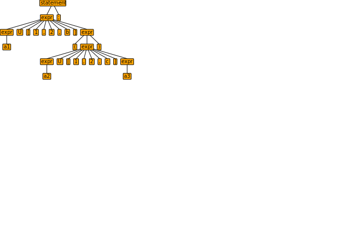

# Notes on MLTLM to MLTL translator


#### Tutorial example:


Let's consider the expression G[2,5,b] ( F[2,5,b] a0 ) to be converted to MLTL. We use the modulo reduction function, 
$$f_s(\pi_\alpha) \;=\; \pi_\beta.\  \forall i \ 0 \leq i < n/s. \ \pi_\beta [i] := \pi_\alpha [i\ s],$$

F[2,5,b] a0 is expanded as:
$$(G[4,4] a0 | G[6,6] a0 |\cdots | G[10,10] a0)  $$

Expanding the outer part, we have:
$$ G[4,4] ((G[4,4] a0 | G[6,6] a0 |\cdots | G[10,10] a0)) $$

$$\& G[6,6] ((G[4,4] a0 | G[6,6] a0 |\cdots | G[10,10] a0)) $$

$$\& G[8,8] ((G[4,4] a0 | G[6,6] a0 |\cdots | G[10,10] a0)) $$

$$\& G[10,10] ((G[4,4] a0 | G[6,6] a0 |\cdots | G[10,10] a0)) $$


Exploration stack for the above:

| opName | bounds | timeName | left | right | fromTime |
| ------ | ------ | -------- | ---- | ----- | -------- |
| G      | [2,5]  | c        | -    | F[2,14,b] a0 | |
|  F | [2,14] | b | - | a0 |  a |


## Correctness proof

Here I give the proof of correctness of the algorithm to translate from MLTLM to MLTL.

We specify the grammar of MLTLM as follows.

A Program is a set of statements.

A statement is an expression followed by a semicolon.

An expression is recursively one of the following:
<pre>
- UnaryOperator [number, number,  identifier] expression                # unary_expr
-  expression BinaryOperator [number, number, identifier] expression    # binary_expr
- ! expression                                                          # unary_expr
- expression & expression                                               # binary_expr
- expression |  expression                                              # binary_expr
- expression <-> expression                                             # binary_expr
- expression -> expression                                              # binary_expr
- Identifier                                                            # atomic_expr
- TRUE                                                                  # bool_expr
- FALSE                                                                 # bool_expr
</pre>

The first two denote the Unary (e.g., global and future temporal operators) and Binary (Until and Release operators) temporal operators. The remaining are propositional operators, the Identifier refers to an atomic expression, and TRUE and FALSE are Boolean truth values. The hashtags at the end of each expression type denotes the type of operator, either unary or binary.

Antlr generates a parse tree for a given MLTLM statement. For example the expression a1 "U[1,2,b] ( a2 U[1,2,c] a3);" is parsed in to a tree as shown below:

[](antlr4_parse_tree.svg)

Antlr further generates an interface to visit nodes on the parse tree based on the unique hash tags issued (the #unary_expr, #binary_expr etc.) while specifying the recursive definition. In this case, the following interfaces are produced using Antlr:

- visitProgram;
- visitUnary_expr;
- visitBinary_expr;
- visitStatement;
- visitAtom_expr;
- visitBool_expr;

Whenever, the function visit(statement) or visit(expression) or visit(program) etc. is called, the function enters into the appropriate node, and automatically enters into the children node by default. We modify this behavior such that when it enters the node, we have it do the translation before it exits the node and moves to the children.

To prove correctness, we need to show that a given MLTLM statement is converted correctly into an equivalent MLTL statement. Therefore, we will assume that the program takes an expression from a statement (i.e., an "expr;") as an input, and translates that expression into an equivalent MLTL formula. As we start at the level of an expression extracted from a statement, we will visit nodes in a tree using one of the following:

- visitUnary_expr;
- visitBinary_expr;
- visitAtom_expr;
- visitBool_expr;

While visiting the nodes in the tree, we will use a class MyExpression that will store information of the node that we visited which hold the following information:

- opName
- bounds 
- timeName
- left
- right
- fromtimeName

For example, the when visiting the the top node of the expression "a1 U[1,2,b] ( a2 U[1,2,c] a3);", we have:

- opName = "U"
- bounds = [1,2]
- timeName = "b"
- left      = a1
- right    = ( a2 U[1,2,c] a3)
- fromtimeName = -

The fromtimeName is a place holder while translating and will be assigned later. The function reconstruct takes an input MyExpression and returns a string representation of the expression as a whole, i.e., "a1 U[1,2,b] ( a2 U[1,2,c] a3)", and the function reconstruct2 takes an input MyExpression and returns a string representation of the expression as a whole sans the timeName of the root temporal operator, as in "a1 U[1,2] ( a2 U[1,2,c] a3)" 


Lastly, we use a stackedExps that is a stack of variables of type MyExpression. The algorithm for translation will then use the following pattern when visiting binary and unary operators:

```cpp
visitUnary_expr(node){
    stackedExps.insert(node);
    // Current size
    nowSize = stackedExps.size();
    visit(node->expr());
    // if size is greater, we are not at the leaves
    if (stackedExps.size() > nowSize) {
      stackedExps[nowSize - 1].right = moduloReduction(stackedExps[nowSize]);
      stackedExps[nowSize - 1].fromTimeName = stackedExps[nowSize].fromTimeName;
      if (stackedExps[nowSize - 1].timeName.empty()) {
        stackedExps[nowSize - 1].timeName = stackedExps[nowSize - 1].fromTimeName;
      }
      stackedExps.pop();
    } else {
      // if size is the same, we are at leaves
      stackedExps[nowSize - 1].fromTimeName = "a";
      // If the timeName field is empty then time is same as fromTime.
      if (stackedExps[nowSize - 1].timeName.empty()) {
        stackedExps[nowSize - 1].timeName = stackedExps[nowSize - 1].fromTimeName;
      }
    }  
}


```
```cpp
visitBinary_expr(node) {
    stackedExps.insert(node);
    nowSize = stackedExps.size();
    // Has two sub expressions as binary
    for sub in node->expr() {
      visit(sub);
    }
    // Has both sides temporal operator:
    if (stackedExps.size() == nowSize + 2) {
      // Check if both sides of binary operator have the
      // same time name
      if (stackedExps[nowSize].timeName != stackedExps[nowSize + 1].timeName) {
        error("Both sides of binary operator must have the same time name.");
      }
      
      stackedExps[nowSize - 1].left = moduloReduction(stackedExps[nowSize]);
      stackedExps[nowSize - 1].right = moduloReduction(stackedExps[nowSize + 1]);
      stackedExps[nowSize - 1].fromTimeName = stackedExps[nowSize].fromTimeName;
      
      if (stackedExps[nowSize - 1].timeName.empty()) {
        stackedExps[nowSize - 1].timeName = stackedExps[nowSize - 1].fromTimeName;
      }
      stackedExps.pop();
      stackedExps.pop();
    } else if (stackedExps.size() == nowSize + 1) {
      // One side is a atomic proposition
      if (stackedExps[nowSize].timeName != "a") {
        error("Both sides of binary operator must have the same time name. "
                "Note that atomic proposition has default time name \"a\" ");
      }
      // find which side is atomic:
      if (subs2[0]->children.size() == 0) {
        // left side is atomic.
        stackedExps[nowSize - 1].left = moduloReduction(stackedExps[nowSize]);
        stackedExps[nowSize - 1].fromTimeName = stackedExps[nowSize].fromTimeName;
      } else {
        // right side is atomic.
        stackedExps[nowSize - 1].right = moduloReduction(stackedExps[nowSize]);
        stackedExps[nowSize - 1].fromTimeName = stackedExps[nowSize].fromTimeName;
      }
      if (stackedExps[nowSize - 1].timeName.empty()) {
        stackedExps[nowSize - 1].timeName = stackedExps[nowSize - 1].fromTimeName;
      }
      stackedExps.pop_back();
    } else {
      // if size is the same, we are at leaves
      stackedExps[nowSize - 1].fromTimeName = "a";
      // If the timeName field is empty (for a prop operator)
      // then time is same as fromTime.
      if (stackedExps[nowSize - 1].timeName.empty()) {
        stackedExps[nowSize - 1].timeName = stackedExps[nowSize - 1].fromTimeName;
      }
    }
    return 0;
};
```

```cpp
int main(){
    for statement in statements {
        expression = statement->expr();
        visit(expression); 
        if (stackedExps.empty()) {
            out =  expression->getText();
        } else {  
            out = moduloReduction(stackedExps[0]);
        }
    stackedExps.clear();
    }
  return 0;
}
```

If the statement is simply an atomic proposition, then the algorithm works because it simply prints the same proposition as the formula in MLTL.

If the statement is a formula that contains a unary or binary operator, then we prove the correctness by induction on the stack of expressions created by the algorithm.

The stack is created first, till until the leaves. Once the stack is created, the right and left sides for binary or only the right side unary operators are updated with translated versions of the subexpression. 

**Stack created for G[1,2,d] ( G[1,2,c] a0 & G[1,2,c] a1)**

| opName | bounds | timeName | left | right | fromTime |
| ------ | ------ | -------- | ---- | ----- | -------- |
| G      | [1,2]  | d        | -    | G[1,2,c] a0 & G[1,2,d] a1 | |
|  &     |  -     |  -       | G[1,2,c] a0 | G[1,2,d] a1 | |
|  G | [1,2] | c | - | a0 |  a |
| G | [1,2] | c | - | a1 | a |

**Unstacking step 1:**

| opName | bounds | timeName | left | right | fromTime |
| ------ | ------ | -------- | ---- | ----- | -------- |
| G      | [1,2]  | d        | -    | G[1,2,c] a0 & G[1,2,c] a1 | |
|  &     |  -     |  -       | moduloReduce(G[1,2,c] a0) | moduloReduce(G[1,2,c] a1) | |


**Unstacking step 2:**

| opName | bounds | timeName | left | right | fromTime |
| ------ | ------ | -------- | ---- | ----- | -------- |
| G      | [1,2]  | d        | -    | moduloReduce(G[1,2,c] a0) & moduloReduce(G[1,2,c] a1) | |

**Final unstacking:**

moduloReduce( G[1,2,d] ( moduloReduce( G[1,2,c] a0 ) & moduloReduce( G[1,2,c] a1 ) ) )

#### Modulo reduction function:

The moduloReduce function takes an MyExpression as an input, and processes a translation from fromTimeName to timeName. 

- If the two time-names are the same, then it simply removes the time scale name and produces string of the expression; this comes from the definition of MLTLM. 
- If the time names are different, then it makes the conversion from the timeName to the fromTimeName produces the string MLTL expression.

*Claim: The from time name is the time name of the subexpressions, and the time name time assocaited with the operator. The fromTimeName is invariably always the base time name of the atomic proposition, "a"*

The traverses to the leaves, and the leaves has atomic propositions invariably, and this time scale has to propogate through to the root.

For example, G[1,2,c] a0 is an expression in time scale "c". The moduloReduce( G[1,2,c] a0 ) gives the equivalent expression in timescale "a". G[1,2,d] ( moduloReduce( G[1,2,c] a0 ) is an expression in time scale "d", and the subexpression has a timescale "a". moduloReduce( G[1,2,d] ( moduloReduce( G[1,2,c] a0 ) ) ) gives the equivalent expression in "a".

#### Proof of correctness:
A given statement is simply "expr;", the expression is extracted. The expression can be any of what is listed, a binary or unary combination of expressions, an atomic or a boolean. Only if it is unary or binary (i.e., it visits visitUnary or visitBinary), and the current node expression is added to the stack. The function then recursively calls to visit the subexpressions. After having visited subexpressions, the stack size can only increase if the subexpressions have further subexpressions (subexpressions with temporal or propositional connectives), because if the expression has only atomic propositions as subexpressions, then the size will not change. So this is used to detect if the expression tree has reached its leaves.

If it did reach the leaf as detected from above, then the fromTimeName field is set to "a", as an atomic proposition has a default time name of the same. And if the timeName field is empty (as in the case (a0 & a1) or (!a0)), the time name is set to be the same as the fromTimeName.

If it did not reach the leaf (i.e., the number of elements in teh stack increased from the current size), then it does the modulo reduction on the new elements in the stack and replaces the left and right members of the current element in the stack with strings produced by modulo reduction, then assigns the current element's fromTimeName as the fromTimeName of children element and pops it (for unary, them for binary) out.

*There can be at most two additional elements in the stack for binary operator, and one additional element in the stack for unary operator.*

We prove by induction. The base case we choose is when the exploration is at an expression where there are no more unary or binary nestings within the operator, e.g., (a0 U[1,2,c] a1 is a valid base case, while (a0 & a2) U[1,2,c] a1 is not). In this case there are 0 additional entities in the stack. Because elements are added to stack only if there are binary or unary operators in the children. So the statement holds for this case.

Hypothesis: In a nested instance, there are at most two additional entities added to the stack for binary and one for a unary operator.

To prove: The parent also has at most two additional entities added to the stack for binary and one for unary.

Proof: The nested instance in the hypothesis is inherently a subexpression of a parent unary or binary expression. Having assumed that the nested instance have at most two additional entries in the stack, the two are popped out before it exits the visitor interface, because it is also a unary or binary instance. If it is a subexpression of a unary operator, then only this one will remain (because we assumed in the hypothesis that it has at most one, which is already popped out). If it is a subexpression of a binary operator, then there will exists two such subexpressions only if both sides of the parent are nested operators. In this case, the hypothesis holds for both sides, and both sides will pop out their remaining entries in the stack (from the hypothesis), and only they will remain in the stack. In this case the binary operator has both sides nested operators. The other possibility is that one of the sides is atomic, while the other is a composition of unary and binary operators. In this case also the one side will be popped out, and only it will remain in the stack, in this case the parent will have only one extra entry in the stack. If both of the parent are atomics, we have reached the base case of the induction. Hence proved.    

The right and left sides are replaced by the MLTL translation of the subexpression, and the fromTimeName is updated from the subexpression. 

This can again be proved by induction in a similar manner as above, in that instead of the pop-out operation, we will use the moduloReduction operator. The base case is that the moduloReduction function does the correct translation between two timescales from MLTLM to MLTL without any nested temporal operators.
